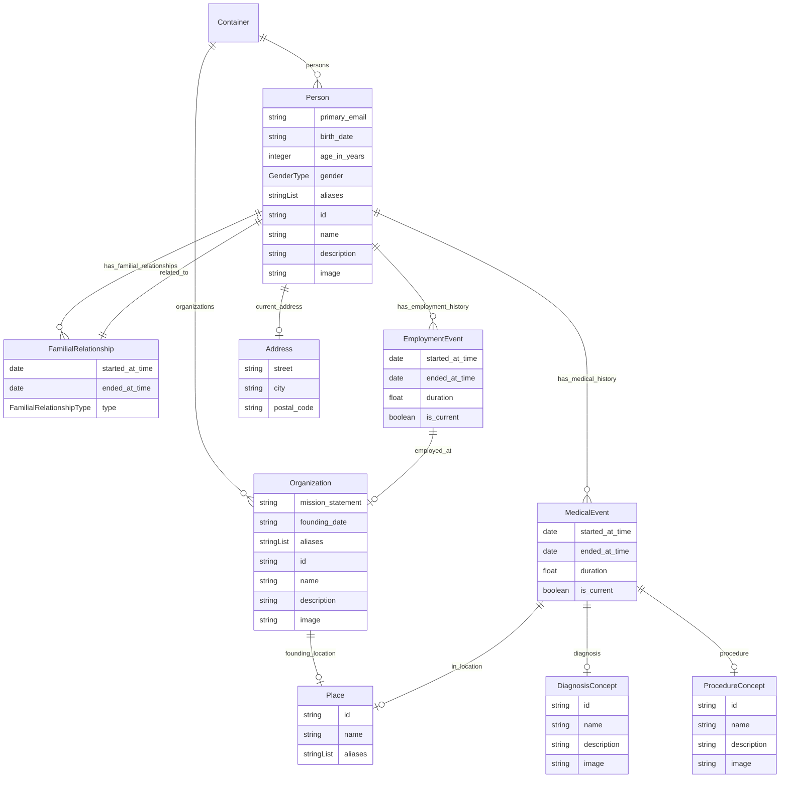

```mermaid
erDiagram
Container {

}
Organization {
    string mission_statement  
    string founding_date  
    stringList aliases  
    string id  
    string name  
    string description  
    string image  
}
Place {
    string id  
    string name  
    stringList aliases  
}
Person {
    string primary_email  
    string birth_date  
    integer age_in_years  
    GenderType gender  
    stringList aliases  
    string id  
    string name  
    string description  
    string image  
}
MedicalEvent {
    date started_at_time  
    date ended_at_time  
    float duration  
    boolean is_current  
}
ProcedureConcept {
    string id  
    string name  
    string description  
    string image  
}
DiagnosisConcept {
    string id  
    string name  
    string description  
    string image  
}
FamilialRelationship {
    date started_at_time  
    date ended_at_time  
    FamilialRelationshipType type  
}
EmploymentEvent {
    date started_at_time  
    date ended_at_time  
    float duration  
    boolean is_current  
}
Address {
    string street  
    string city  
    string postal_code  
}

Container ||--}o Person : "persons"
Container ||--}o Organization : "organizations"
Organization ||--|o Place : "founding_location"
Person ||--|o Address : "current_address"
Person ||--}o EmploymentEvent : "has_employment_history"
Person ||--}o FamilialRelationship : "has_familial_relationships"
Person ||--}o MedicalEvent : "has_medical_history"
MedicalEvent ||--|o Place : "in_location"
MedicalEvent ||--|o DiagnosisConcept : "diagnosis"
MedicalEvent ||--|o ProcedureConcept : "procedure"
FamilialRelationship ||--|| Person : "related_to"
EmploymentEvent ||--|o Organization : "employed_at"

```
